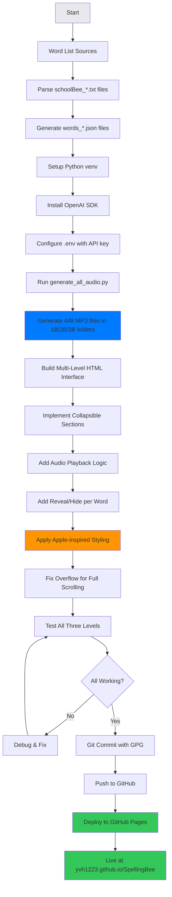

# SpellingBee Practice

A minimalist, pronunciation-driven spelling practice website with three difficulty levels for school spelling bee preparation.

**🌐 Live Site:** https://yvh1223.github.io/SpellingBee/


## Features

- **448 pronunciation-driven spelling words** across three levels
  - **1B (Basic)**: 145 foundational words
  - **2B (Intermediate)**: 158 challenging words
  - **3B (Advanced)**: 145 school bee words
- Audio playback for each word (OpenAI TTS - Alloy voice)
- Collapsible sections for each difficulty level
- Progressive reveal/hide functionality per word
- Apple-inspired minimalist design
- Fully responsive (mobile/tablet/desktop)
- No tracking, ads, or logins

## Quick Start

```bash
# Clone and open
git clone https://github.com/yvh1223/SpellingBee
cd SpellingBee
open index.html
```

## Project Structure

```
/SpellingBee
  index.html                    # Landing page with collapsible sections
  /css
    style.css                   # Minimalist styling with smooth animations
  /js
    app.js                      # Multi-level word loading & playback logic
  /audio                        # Organized by difficulty level
    /1B                         # 145 MP3 files for basic words
    /2B                         # 158 MP3 files for intermediate words
    /3B                         # 145 MP3 files for advanced words
  /data                         # JSON word data
    words_1B.json               # Basic level words
    words_2B.json               # Intermediate level words
    words_3B.json               # Advanced level words
  generate_all_audio.py         # Multi-level audio generation script
  requirements.txt              # Python dependencies
  .env.example                  # API key template
  AUDIO_GENERATION_MULTI.md     # Audio generation guide
  schoolBee_1.txt               # Source: 1B word list
  schoolBee_2.txt               # Source: 2B word list
  schoolBee_3.txt               # Source: 3B word list
```

## Development Workflow



## Audio Generation

See [AUDIO_GENERATION_MULTI.md](AUDIO_GENERATION_MULTI.md) for detailed instructions.

**Quick Generate All Levels:**
```bash
source venv/bin/activate
python generate_all_audio.py
```

- Generates audio for all three levels (1B, 2B, 3B)
- Uses OpenAI `gpt-4o-mini-tts` model
- Voice: Alloy (US English)
- Cost: ~$0.09 for all 448 files
- Skips existing files (use `--force` to regenerate)
- Organizes output into level-specific folders

## Design Principles

- **Pronunciation First**: Audio-driven learning experience
- **Progressive Reveal**: Words masked until revealed
- **Multi-Level Support**: Three difficulty levels with collapsible sections
- **Minimalist UI**: Apple-inspired clean design
- **Calm Colors**: Neutral grays (#fafafa, #e8e8ed, #1d1d1f)
- **Space Efficient**: Grid layout with large readable fonts
- **Smooth Animations**: Expand/collapse transitions with opacity
- **Mobile Friendly**: Responsive breakpoints at 768px and 480px

## Tech Stack

- Pure HTML5, CSS3, Vanilla JavaScript
- No frameworks or dependencies
- OpenAI TTS for audio generation
- Python 3.13+ (with SSL workaround for macOS)
- GitHub Pages deployment

## Word Count Breakdown

| Level | Description | Words | Difficulty |
|-------|-------------|-------|------------|
| 1B | Basic | 145 | Foundational spelling words (e.g., "tag", "elephant", "chocolate") |
| 2B | Intermediate | 158 | Challenging words (e.g., "almanac", "archipelago", "eccentric") |
| 3B | Advanced | 145 | School bee level (e.g., "apocalypse", "silhouette", "tuberculosis") |
| **Total** | | **448** | |

## License

Personal use only - built for Vihaan's spelling bee preparation.
