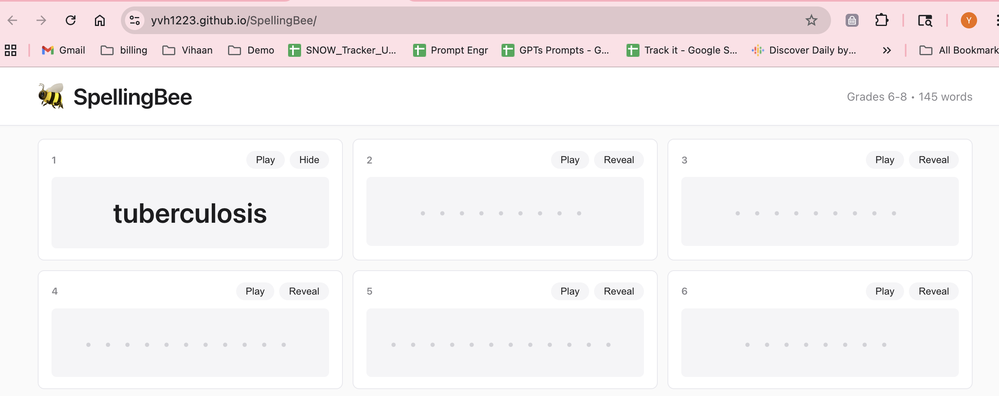
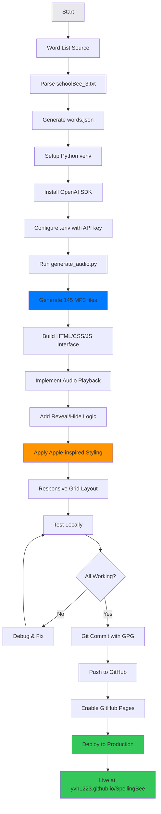

# SpellingBee Practice

A minimalist, pronunciation-driven spelling practice website for grades 6-8.

**🌐 Live Site:** https://yvh1223.github.io/SpellingBee/



## Features

- 145 pronunciation-driven spelling words
- Audio playback for each word (OpenAI TTS - Alloy voice)
- Progressive reveal/hide functionality
- Apple-inspired minimalist design
- Fully responsive (mobile/tablet/desktop)
- No tracking, ads, or logins

## Quick Start

```bash
# Clone and open
git clone https://github.com/yvh1223/SpellingBee
cd SpellingBee
open index.html
```

## Project Structure

```
/SpellingBee
  index.html              # Main interface
  /css
    style.css             # Minimalist styling
  /js
    app.js                # Word loading & playback logic
  /audio                  # 145 MP3 pronunciation files
  words.json              # All words with IDs
  generate_audio.py       # Audio generation script
  requirements.txt        # Python dependencies
  .env.example            # API key template
  AUDIO_GENERATION.md     # Audio generation guide
```

## Development Workflow



## Audio Generation

See [AUDIO_GENERATION.md](AUDIO_GENERATION.md) for detailed instructions.

**Quick Generate:**
```bash
source venv/bin/activate
python generate_audio.py
```

- Uses OpenAI `gpt-4o-mini-tts` model
- Voice: Alloy (US English)
- Cost: ~$0.03 for all 145 files
- Skips existing files (use `--force` to regenerate)

## Design Principles

- **Pronunciation First**: Audio-driven learning experience
- **Progressive Reveal**: Words masked until revealed
- **Minimalist UI**: Apple-inspired clean design
- **Calm Colors**: Neutral grays (#fafafa, #e8e8ed, #1d1d1f)
- **Space Efficient**: Grid layout with large readable fonts
- **Mobile Friendly**: Responsive breakpoints at 768px and 480px

## Tech Stack

- Pure HTML5, CSS3, Vanilla JavaScript
- No frameworks or dependencies
- OpenAI TTS for audio generation
- Python 3.13+ (with SSL workaround for macOS)
- GitHub Pages deployment

## License

Personal use only - built for Vihaan's spelling bee preparation.
